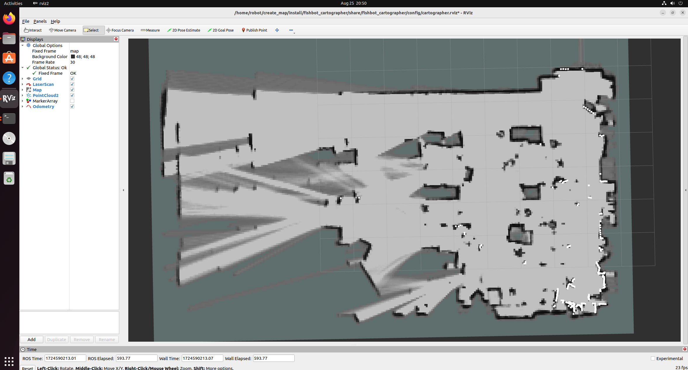

# ROS2+单激光雷达建图

所谓单激光雷达建图指不依靠IMU或者里程计信息，只使用雷达的深度点云进行建图，当我们的机器人在摩擦力较小容易打滑的地面或者没有里程计信息的机器人上，只使用激光雷达进行定位和建图往往可以取得较好的效果。



只要从里程计+雷达SLAM，切换成纯雷达SLAM只需要修改Cartographer的参数即可。

本代码基于Ubuntu22.04+ROS 2.0 humble版本进行测试。

在ROS2的工作空间下拷贝单激光雷达建图cartographer配置文件到src/目录下

重点查看src/fishbot_cartographer/config/fishbot_laser_2d.lua

src/fishbot_cartographer/launch/cartographer_pure_laser.launch.py

两个主要文件参数根据自己需要的修改

其中fishbot_laser_2d.lua

```lua
  --  跟踪和发布的frame都改成雷达的frameID
  tracking_frame = "laser_frame",
  published_frame = "laser_frame",
  odom_frame = "odom",
  -- true改为false，不用提供里程计数据
  provide_odom_frame = true,
  -- false改为true，仅发布2D位资
  publish_frame_projected_to_2d = false,
  use_pose_extrapolator = true,
  -- true改为false，不使用里程计数据
```

cartographer_pure_laser.launch.py不作过大修改


